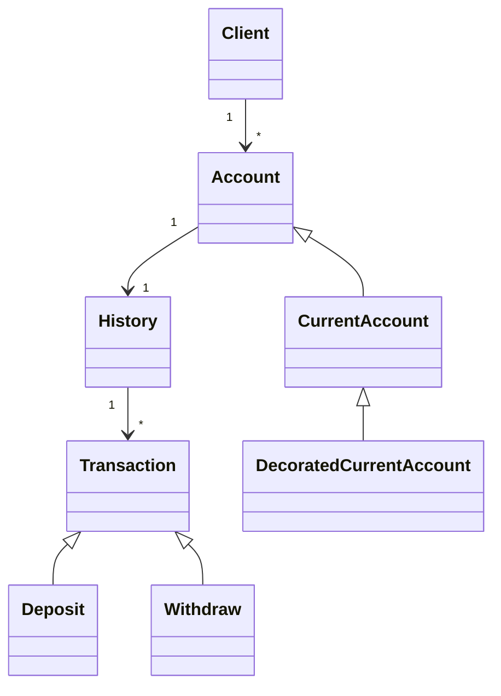

<div align="center">

# 🐍 Desafios e Atividades em Python

Repositório de estudos com exercícios de lógica, atividades acadêmicas e projetos desenvolvidos durante o aprendizado da linguagem Python.


</div>

---

## 📌 Sobre o repositório

Este repositório reúne exercícios, desafios e pequenos projetos desenvolvidos durante cursos, atividades acadêmicas e estudos independentes de Python.

Os códigos representam diferentes etapas do aprendizado, desde programas introdutórios até uma implementação orientada a objetos de um sistema bancário.

O objetivo é:

* praticar a sintaxe da linguagem;
* desenvolver lógica de programação;
* resolver problemas;
* registrar a evolução nos estudos;
* aplicar conceitos de orientação a objetos;
* manter exemplos para futuras consultas.

> Os projetos possuem finalidade educacional e podem conter soluções iniciais que serão refatoradas conforme a evolução técnica.

---

## 🧠 Conteúdos praticados

### Fundamentos

* variáveis;
* tipos de dados;
* entrada com `input`;
* saída com `print`;
* operadores;
* conversão de tipos;
* formatação de strings;
* cálculos matemáticos.

### Estruturas de controle

* `if`;
* `elif`;
* `else`;
* `for`;
* `while`;
* condições;
* contadores;
* limites de operações.

### Estruturas de dados

* listas;
* tuplas;
* dicionários;
* percursos;
* armazenamento de objetos;
* filtros;
* generators;
* iteradores.

### Programação orientada a objetos

* classes;
* objetos;
* herança;
* abstração;
* polimorfismo;
* métodos;
* propriedades;
* classes abstratas;
* composição;
* decorators.

### Outros conceitos

* leitura e escrita de arquivos;
* logs;
* datas e horários;
* modularização;
* validações;
* tratamento de regras de negócio.

---

## 📂 Organização do repositório

```text
Desafios-e-Atividades-em-Python/
│
├── DIO/
│   └── sistema_bancario_teste.py
│
├── Estacio/
│   ├── ex011.py
│   ├── ex012.py
│   ├── ex013.py
│   ├── ex014.py
│   ├── ex015.py
│   └── outros exercícios
│
├── .gitignore
└── README.md
```

| Diretório | Conteúdo                                                                 |
| --------- | ------------------------------------------------------------------------ |
| `DIO`     | Desafios e projetos desenvolvidos em formações da Digital Innovation One |
| `Estacio` | Exercícios acadêmicos e atividades introdutórias de Python               |

---

## 🧩 Exercícios introdutórios

Os exercícios da pasta `Estacio` trabalham problemas básicos de programação.

### Conversor de medidas

Converte um valor informado em metros para:

* decímetros;
* centímetros;
* milímetros;
* decâmetros;
* hectômetros;
* quilômetros.

Conceitos praticados:

* entrada numérica;
* operações matemáticas;
* variáveis;
* f-strings.

---

### Tabuada

Recebe um número inteiro e exibe sua tabuada de 1 a 10.

Conceitos praticados:

* entrada de dados;
* multiplicação;
* formatação de saída.

---

### Conversor de moedas

Realiza conversões simples entre real e dólar utilizando uma cotação definida no código.

Conceitos praticados:

* números reais;
* divisão;
* multiplicação;
* formatação monetária.

> A cotação é fixa e possui finalidade educacional. Ela não representa o valor atual da moeda.

---

### Cálculo de tinta

Calcula:

* área de uma parede;
* quantidade aproximada de tinta necessária.

Fórmulas utilizadas:

```text
área = largura × altura
```

```text
tinta necessária = área ÷ rendimento
```

---

## 🏦 Sistema bancário

O arquivo principal da pasta `DIO` implementa um sistema bancário de terminal.

```text
DIO/sistema_bancario_teste.py
```

O projeto utiliza conceitos mais avançados de Python e orientação a objetos.

### Funcionalidades implementadas

* cadastro de clientes;
* criação de contas;
* depósitos;
* saques;
* histórico de transações;
* limite de saques;
* limite de valor por saque;
* limite diário de transações;
* registro de operações em arquivo de log;
* geração de relatórios;
* filtro de transações;
* iteração entre contas.

---

## 🧱 Estrutura conceitual do sistema bancário



---

## 🧩 Componentes do sistema bancário

### Transação

Classe abstrata utilizada como base para operações financeiras.

Especializações:

* depósito;
* saque.

### Conta

Representa uma conta bancária e armazena:

* cliente;
* número;
* agência;
* saldo;
* limite;
* histórico;
* quantidade de transações diárias.

### Conta corrente

Especialização de conta que controla:

* limite de valor por saque;
* quantidade máxima de saques.

### Cliente

Representa o titular de uma ou mais contas.

Armazena:

* nome;
* data de nascimento;
* CPF;
* endereço;
* contas associadas.

### Histórico

Mantém as transações realizadas e permite gerar relatórios filtrados.

---

## 📝 Registro de logs

O sistema utiliza um decorator para registrar operações em um arquivo:

```text
log.txt
```

Um registro pode conter:

```text
Data e hora
Operação executada
Argumentos
Resultado
```

Isso permite praticar:

* decorators;
* funções de ordem superior;
* escrita em arquivos;
* auditoria de operações.

---

## 🔁 Generators e iteradores

O projeto utiliza um generator para percorrer transações:

```python
def transaction_generator(filter_type=None):
    for transaction in transactions:
        if filter_type is None or filter_type in transaction:
            yield transaction
```

Também possui um iterador personalizado para percorrer contas.

Esses recursos evitam carregar ou processar todos os elementos antecipadamente e demonstram conceitos importantes do protocolo de iteração do Python.

---

## 🛠️ Tecnologias

| Tecnologia            | Aplicação                   |
| --------------------- | --------------------------- |
| Python 3              | Linguagem principal         |
| Biblioteca `abc`      | Classes abstratas           |
| Biblioteca `datetime` | Datas e horários            |
| Visual Studio Code    | Desenvolvimento             |
| PyCharm               | Desenvolvimento alternativo |
| Git                   | Controle de versão          |
| GitHub                | Hospedagem do projeto       |

---

## 🚀 Como executar

### Pré-requisitos

É necessário possuir:

* Python 3;
* Git;
* terminal ou uma IDE.

Verifique a versão instalada:

```bash
python --version
```

ou:

```bash
python3 --version
```

### Clone o repositório

```bash
git clone https://github.com/ONestoDev/Desafios-e-Atividades-em-Python.git
```

### Acesse a pasta

```bash
cd Desafios-e-Atividades-em-Python
```

### Execute um exercício

```bash
python Estacio/ex011.py
```

No Linux ou macOS:

```bash
python3 Estacio/ex011.py
```

### Execute o sistema bancário

```bash
python DIO/sistema_bancario_teste.py
```

---

## ✅ Pontos fortes

O repositório demonstra evolução entre diferentes níveis:

* exercícios básicos de sintaxe;
* cálculos;
* entrada e saída;
* estruturas de controle;
* listas;
* funções;
* orientação a objetos;
* herança;
* abstração;
* decorators;
* generators;
* iteradores;
* manipulação de arquivos.

O sistema bancário é o projeto mais completo e relevante do repositório.

---

## ⚠️ Limitações atuais

O repositório ainda possui alguns pontos que podem ser melhorados:

* organização pouco detalhada;
* nomes genéricos como `ex011.py`;
* ausência de descrição individual dos exercícios;
* arquivos da IDE versionados;
* ausência de testes automatizados;
* sistema bancário concentrado em um único arquivo;
* nomenclatura excessivamente complexa no sistema bancário;
* vários comentários `TODO`;
* mensagens do sistema em inglês enquanto o repositório está em português;
* ausência de tratamento consistente para entradas inválidas;
* ausência de dependências documentadas;
* ausência de licença confirmada por um arquivo `LICENSE`.

---

## 🗺️ Melhorias futuras

* criar um índice dos exercícios;
* organizar exercícios por assunto;
* adicionar descrição em cada arquivo;
* separar o sistema bancário em módulos;
* simplificar nomes de classes e métodos;
* adicionar testes com `pytest`;
* utilizar type hints de forma consistente;
* configurar formatter e linter;
* adicionar tratamento de exceções;
* remover arquivos internos da IDE;
* criar um arquivo `requirements.txt`, caso surjam dependências externas;
* adicionar documentação do sistema bancário.

---

## 📁 Estrutura recomendada

```text
Desafios-e-Atividades-em-Python/
│
├── exercicios/
│   ├── fundamentos/
│   ├── condicionais/
│   ├── repeticao/
│   ├── listas/
│   └── funcoes/
│
├── projetos/
│   └── sistema-bancario/
│       ├── main.py
│       ├── models/
│       ├── services/
│       ├── utils/
│       └── tests/
│
├── .gitignore
├── README.md
└── LICENSE
```

---

## 🧪 Testes recomendados

| Cenário                | Resultado esperado               |
| ---------------------- | -------------------------------- |
| Depósito positivo      | Saldo atualizado                 |
| Depósito negativo      | Operação rejeitada               |
| Saque válido           | Saldo reduzido                   |
| Saque acima do saldo   | Operação rejeitada               |
| Saque acima do limite  | Operação rejeitada               |
| Excesso de saques      | Operação rejeitada               |
| CPF duplicado          | Cadastro rejeitado               |
| Cliente inexistente    | Conta não criada                 |
| Limite diário atingido | Nova operação bloqueada          |
| Filtro de transações   | Apenas registros correspondentes |

---

## 📚 Aprendizados desenvolvidos

Durante os exercícios e projetos foram praticados:

* lógica de programação;
* sintaxe Python;
* variáveis;
* operadores;
* entrada e saída;
* estruturas condicionais;
* repetições;
* listas;
* funções;
* classes;
* objetos;
* herança;
* abstração;
* polimorfismo;
* decorators;
* generators;
* iteradores;
* arquivos;
* regras de negócio.

---

## 🎓 Contexto educacional

Os códigos foram desenvolvidos durante atividades acadêmicas, cursos e formações de Python.

O repositório funciona como registro da evolução desde exercícios introdutórios até uma aplicação bancária orientada a objetos.

---

## 👨‍💻 Autor

Desenvolvido por **Ernesto — ONestoDev**.

[](https://github.com/ONestoDev)

---

## 📄 Licença

O README atual menciona a licença MIT.

Para formalizar essa licença, mantenha também um arquivo `LICENSE` na raiz do repositório.
